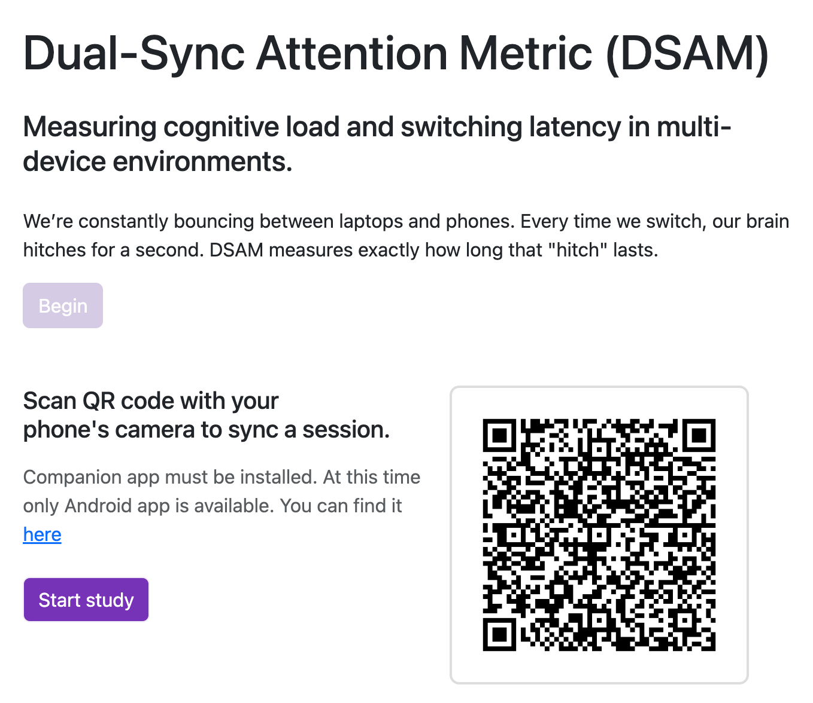
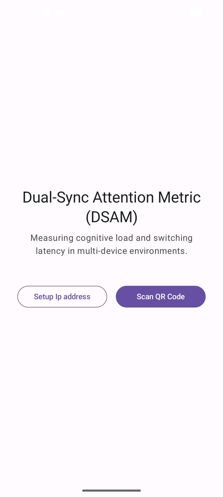
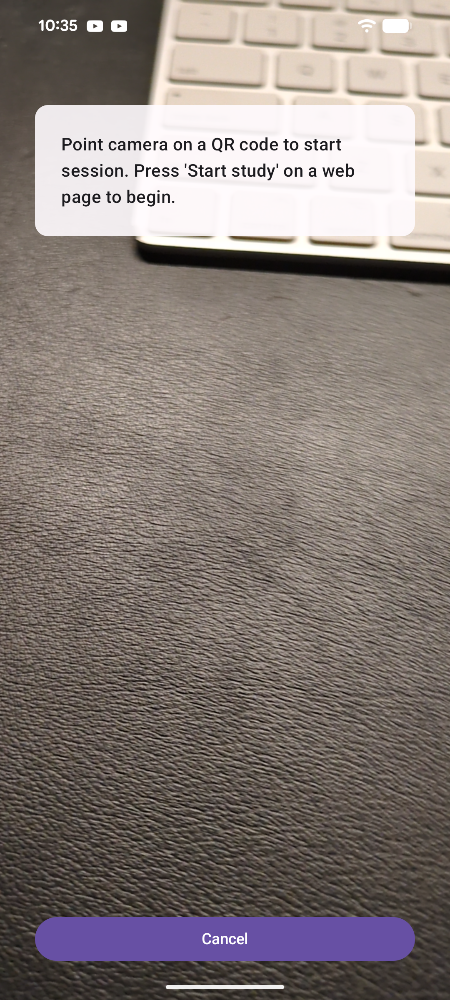
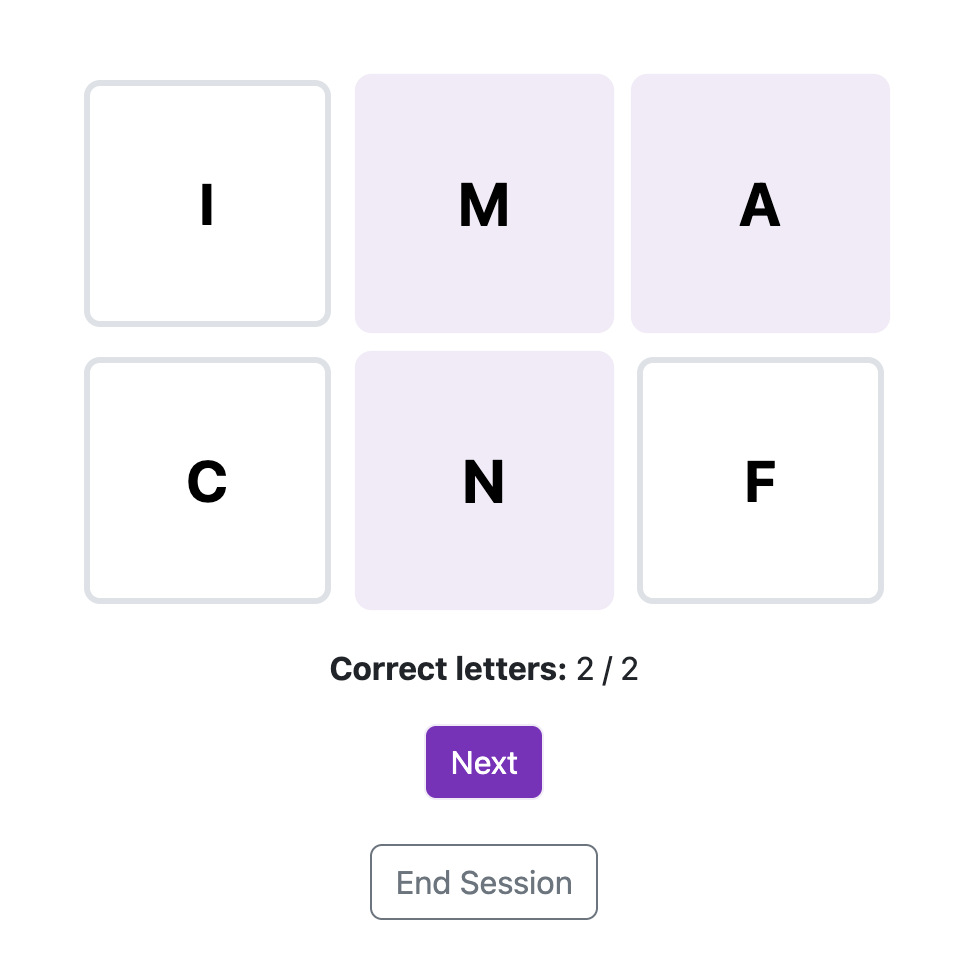
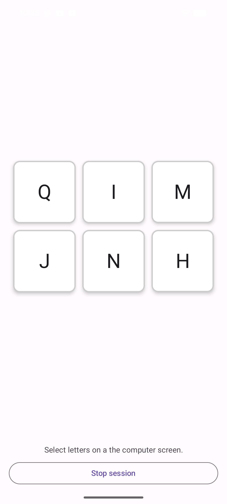
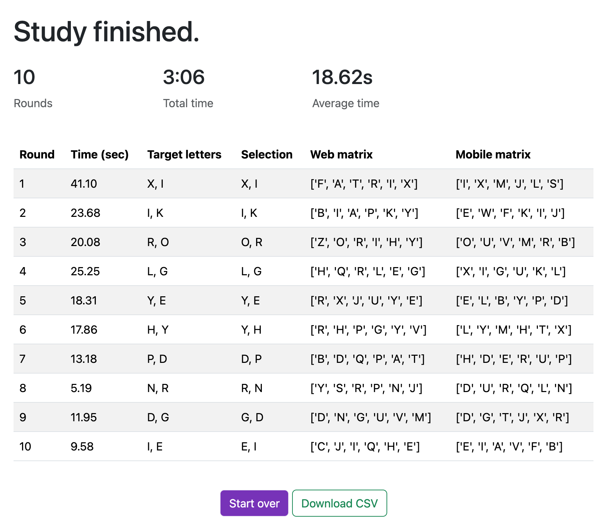

# Letter Matrix - Attention Switching Research Application

A research application for studying attention switching between devices (computer, mobile phone, XR Glasses). Participants search for matching letters in 6-letter matrices displayed on both devices simultaneously.

## 🎯 Project Overview



This application consists of two parts:
1. **Django Web Application** - Runs on a computer, displays letter matrices, and manages research sessions;
2. **Android Mobile App** - Displays different letter matrices on the phone and synchronizes with the computer.

### How It Works

1. Researcher starts a session on the computer;
    - 
2. Launch mobile app and set IP address of your computer:
    - 
    - 
3. Participant scans a QR code via [mobile app](https://github.com/Ninikitos/Attention-Switching-research-application/tree/main/debug_apk) with their phone to join the session; 
    - 
3. Both devices show different 6-letter matrices (3×2 grid);
    - 
    - 
4. Two letters are common between both matrices (target letters);
5. Participant selects 2 matching letters on the computer;
6. When correct letters are selected, both devices automatically show new matrices;
7. Process repeats for 10 rounds;
8. Results are saved and can be downloaded.
    - 

## Use cases
### 1. 🧠 Does Multitasking Actually Slow You Down?

- See if people get slower and make more mistakes when they have to look back and forth between a computer and their phone;
- What you measure: How fast people respond, how many mistakes they make.

### 2. 👓 Computer Screen vs. AR Glasses
Replace the phone with AR/VR glasses to test something different - switching between looking at a screen far away and looking at something right in front of your face.
Usage:

- Use XR glasses instead of a phone;
- Computer shows letters at normal distance;
- Glasses show letters super close to your eyes, switch distance to a monitor;
- Find out if switching between near and far vision is harder than just looking at two screens;
- *What you measure: How long it takes to refocus, if people's eyes get tired, accuracy at different distances.*

### 3. 👴 Do Older Adults Struggle More with Multiple Devices?

- Compare how young people and older people handle switching between devices - like when grandma tries to text while checking her email;
- *What you measure: Speed differences between age groups, error patterns, when people start getting tired.*

### 4. 📱 Are Work Distractions Really That Bad?
- Mimic a real office situation where someone's constantly checking their phone while working on their computer;
- *What you measure: How much slower people get, when it becomes too much, how often they should take breaks.*

### 5. 🎓 Can Students Really Learn from Two Screens at Once?
- Test if students can actually pay attention to both their laptop and phone at the same time during class;
- *What you measure: Can they remember info from both devices, how long it takes, what they prefer.*

## 📋 Technical Prerequisites

### For Django

- Python installed on the computer;
- pip (Python package manager);
- Computer and phone on the same WiFi network;
- Computer's IP.

### For Android App

- Android Studio;
- Android Debug Bridge(adb) configured;
- Android phone.

## 🚀 Quick Start

### Part 1: Django Webapp Setup

1. **Clone the repository**
```bash
git clone <repository-url>
cd letter_matrix
```

2. **Create virtual environment**
```bash
python -m venv venv

# On Windows:
venv\Scripts\activate

# On Mac/Linux:
source venv/bin/activate
```

3. **Install dependencies**
```bash
pip install -r requirements.txt
```

4. **Apply database migrations**
```bash
python manage.py makemigrations
python manage.py migrate
```

5. **Create admin user (optional)**
If you want to have historical access to data. 
It will be stored inside ```db.sqlite3``` that comes with Django project.
```bash
python manage.py createsuperuser
```

6. **Find your computer's IP address**

**Windows:**
```bash
ipconfig
# Look for "IPv4 Address" under your WiFi adapter
```

**Mac/Linux:**
```bash
ifconfig
# or
ip addr show
# Look for your IP (usually 192.168.x.x)
```

7. **Start the server**
```bash
python manage.py runserver 0.0.0.0:8000
```

The server will be available at `http://YOUR_IP:8000` or at `http://127.0.0.1:8000/`

### Part 2: Android App Setup
Download and install apk manually:
- [Download apk](https://github.com/Ninikitos/Attention-Switching-research-application/tree/main/debug_apk)
- Plugin your phone and make sure adb sees it: 
  - ```adb devices```
- Run this command in a folder where you downloaded apk: 
  - ```adb install app-debug.apk```

1. **Open Android Studio**
   - File → Open → Select the `LetterMatrix` Android project folder and navigate to `SettingsActivity.kt`

2. **Update IP address in code**

**You can also update IP address in Mobile app UI.**

Open `app/src/main/java/com/nilin/lettermatrix/ApiService.kt`:
```kotlin
companion object {
    private var BASE_URL = "http://YOUR_COMPUTER_IP:8000/"  // ← Change this!
}
```

Open `app/src/main/java/com/nilin/lettermatrix/WebSocketClient.kt`:
```kotlin
companion object {
    private const val WS_BASE_URL = "ws://YOUR_COMPUTER_IP:8000"  // ← Change this!
}
```

Replace `YOUR_COMPUTER_IP` with the IP address from step 6 above.

3. **Build the project**
   - Build → Rebuild Project

4. **Run on device or emulator**
   - Connect Android device via USB or start an emulator
   - Run → Run 'app'

## 📱 How to Use

### Starting a Research Session

1. **On Computer:**
   - Open browser: `http://localhost:8000`;
   - Click `Begin` button;
   - A QR code will appear on screen.

2. **On Mobile:**
   - Open the Letter Matrix app;
   - (Optional) Enter server IP if needed;
   - Tap `Scan QR Code`;
   - Grant camera permission if asked;
   - Point camera at the QR code on computer screen.

3. **During Session:**
   - Click `Begin study` on a web page;
   - Computer shows a 3×2 matrix with 6 letters;
   - Phone shows a different 3×2 matrix with 6 letters;
   - 2 letters are the same on both devices (target letters);
   - Select the 2 matching letters on the computer;
   - When both correct letters are selected, click "Next Round";
   - Phone automatically updates with new matrix;
   - Repeat for 10 rounds.

4. **After Completion:**
   - Statistics page shows results;
   - Download data as CSV.

## 🐛 Troubleshooting

### Django Server Issues

**Problem:** Can't access server from phone.
- **Solution:** Make sure both devices are on the same WiFi;
- Check firewall settings allow port 8000;
- Verify server is running with `0.0.0.0:8000` not `127.0.0.1:8000`.

**Problem:** WebSocket connection fails.
- **Solution:** Check `ALLOWED_HOSTS` in `settings.py` includes `'*'` or your IP;
- Ensure `daphne` is first in `INSTALLED_APPS`;
- Restart Django server completely.

**Problem:** "No module named 'channels'".
- **Solution:** `pip install channels daphne`.

### Android App Issues

**Problem:** "CLEARTEXT communication not permitted".
- **Solution:** Already configured in `network_security_config.xml`;
- Check your IP is listed in the configuration.

**Problem:** QR scanner shows black screen.
- **Solution:** Grant camera permission in phone settings;
- Check camera hardware is available.

**Problem:** Letters don't update on phone.
- **Solution:** Check WebSocket connection in Logcat;
- Verify IP address matches in `WebSocketClient.kt` and `ApiService.kt`;
- Ensure Django server is running.

**Problem:** App crashes on 16KB page size warning.
- **Solution:** Click "Don't Show Again" - it's not critical.

## 📈 Collecting Data

After a session completes, you can:

1. **View statistics** - Visit `/statistics/<session_id>/`;
2. **Download CSV** - Click "Download CSV" button;
4. **Access via admin** - Django admin at `/admin/`.
